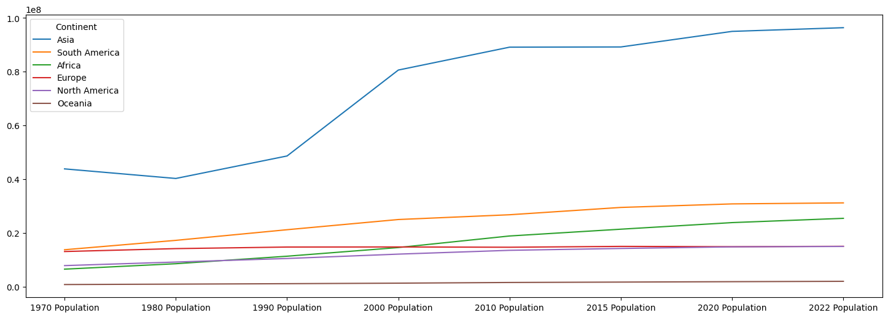

# Pandas Data Cleaning & EDA Practice

This repository contains my hands-on practice with **Pandas**, focusing on key data preprocessing and analysis techniques. It follows a structured learning path through a YouTube playlist, covering real-world data handling scenarios.

### Topics Covered
- Reading data from CSV, Excel, and other formats
- Filtering, sorting, and indexing
- Grouping and aggregation
- Merging and joining DataFrames
- Data cleaning (nulls, duplicates, type conversion)
- Exploratory Data Analysis (EDA)

### Dataset Source
The datasets used are part of a YouTube playlist series.  
To respect ownership rights, datasets are not included.  
You can follow the same learning path here:  
[**Watch the Playlist**](<https://www.youtube.com/watch?v=dUpyC40cF6Q&list=PLUaB-1hjhk8GZOuylZqLz-Qt9RIdZZMBE>)

### Tools & Technologies
- Python
- Pandas
- Jupyter Notebook

### Purpose
This project is part of my data analytics learning journey. It helped me strengthen foundational skills in data manipulation and exploratory analysis using Pandas.

---
